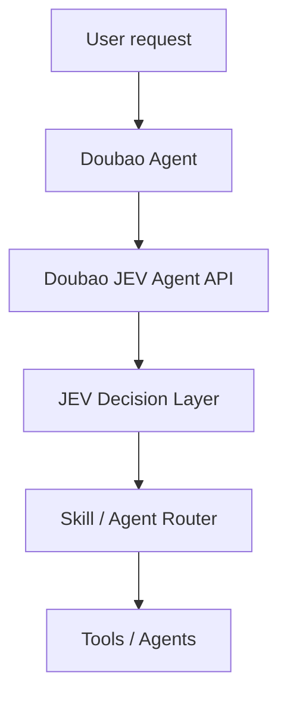

# Doubao JEV Agent

**A decision layer for Doubao Agent powered by JEV.**

> **LLM generates. JEV decides.**

Doubao JEV Agent is a small, extensible decision layer that routes a natural-language task to a Skill or Agent. v0.1 ships with a deterministic mock JEV engine, a provider-neutral Doubao adapter contract, and a FastAPI service. It does not call Doubao or a hosted JEV service.

## Why a decision layer?

An LLM can generate a response, but asking it to pick tools, skills, and agents anew on every turn can make orchestration hard to predict. This project puts routing behind a small decision interface: the caller supplies the task and allowed options, and the JEV client returns a constrained choice with confidence and a reason.

## Architecture



The JEV boundary is asynchronous and replaceable. Without `JEV_API_KEY`, the application uses its deterministic mock. When a key is present, it calls TypeSafe's hosted System One API and validates that the returned choice is among the requested options.

## Quick Start

Requires Python 3.11+.

```bash
python -m venv .venv
# Windows: .venv\Scripts\activate
source .venv/bin/activate
pip install -r requirements.txt
uvicorn src.main:app --reload
```

Open `http://127.0.0.1:8000/docs`. Try a route:

```bash
curl -X POST http://127.0.0.1:8000/route/skill \
  -H 'Content-Type: application/json' \
  -d '{"task":"帮我优化论文格式"}'
```

Response:

```json
{"skill":"paper_skill","confidence":0.94,"reason":"task requires paper or document formatting"}
```

## Demos

Run from the project root:

```bash
python -m examples.skill_router_demo
python -m examples.doubao_demo
python -m examples.agent_router_demo
```

The demos cover paper skill routing, career skill routing, and GitHub issue to coding-agent routing. Each prints the task, selected destination, confidence, and reason for easy terminal screenshots.

## API

- `GET /health` — service health
- `POST /decide` — choose among caller-provided options (`task`, `options`)
- `POST /route/skill` — route a task to a built-in skill
- `POST /route/agent` — route a task to an agent

## Docker

```bash
docker compose up --build
```

The API is then available at `http://localhost:8000`. Mock mode is the default and requires no API key.

## Real JEV API Integration

Request a TypeSafe JEV API key through the [TypeSafe website](https://typesafe.ai/) and create a key in the console when your account has access. The client calls `POST https://api.typesafe.ai/v1/systemone` using Bearer authentication and a typed `choice` question. TypeSafe returns the choice, confidence, and probabilities; this project formats those fields into its `decision`, `confidence`, and `reason` result.

Copy `.env.example` to `.env` and set `JEV_API_KEY` to your key. The key is read from the process environment and is never stored in source. For a shell session, you can export it directly:

```bash
# macOS / Linux
export JEV_API_KEY="your_key_here"

# PowerShell
$env:JEV_API_KEY = "your_key_here"
```

Run the demo from the repository root:

```bash
python -m examples.real_jev_demo
```

It sends `帮我分析这个招聘岗位` with `career_agent`, `coding_agent`, and `writing_agent` as allowed choices, then prints the structured decision, confidence, and reason. Without a key, it automatically runs in mock mode, so local development remains available.

API flow: the demo creates the shared `JEVClient` via `JEVClient.from_env()`, which selects TypeSafe when `JEV_API_KEY` is set or `MockJEVClient` otherwise. The TypeSafe client sends the task as `state`, asks one constrained choice question, validates the returned option, and adapts the typed answer to the existing `DecisionResult` model.

## Tests

```bash
pytest
```

## Roadmap

### v0.1

- Basic decision router
- Doubao skill routing
- Mock JEV engine
- FastAPI service and Docker packaging

### Future
- MCP support
- More Doubao Agent integrations
- Multi-agent workflows

## Scope

This is an early open-source MVP. It has no frontend, database, user system, SaaS layer, or real Doubao API binding. The adapter and JEV client interfaces are extension points, not claims of provider integration.

## License

MIT
