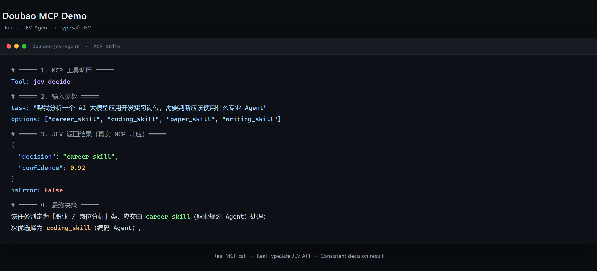
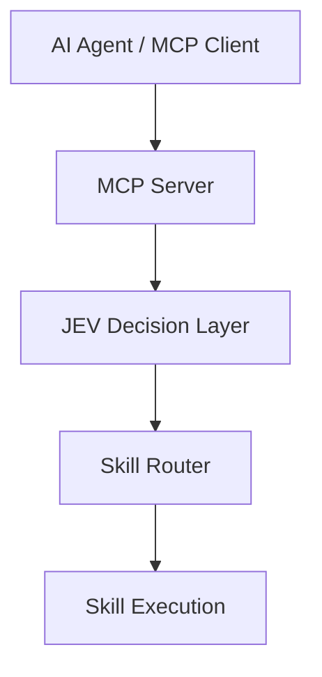

# Doubao-JEV-Agent

**A JEV-powered decision layer for MCP-compatible AI Agents.**

Doubao-JEV-Agent provides a decision layer and MCP interface for AI Agents. It is not a complete autonomous agent; the MCP client supplies the task and allowed choices.

> **LLMs generate. JEV decides.**

Doubao-JEV-Agent is an open-source Python project that exposes JEV decisions and local skill workflows as MCP tools. An MCP-compatible host sends a task to the server; JEV selects from the allowed options; the Skill Executor runs the selected local skill and returns its result.

## Demo



Tested with Doubao Desktop MCP Connector.

Real MCP call → Real TypeSafe JEV API → Decision result.

Run a decision and local skill execution from the repository root:

```bash
python -m examples.agent_run_demo
```

In mock mode, the example selects `career_skill` and shows the executor result:

```text
JEV: career_skill (93.00%)
Executor: career_skill.execute()
结果: Career analysis workflow executed
```

No API key is needed for this demo. With `JEV_API_KEY` set, it calls the real TypeSafe JEV API and the decision may differ.

## Features

- Exposes JEV decisions, skill execution, and skill discovery as MCP tools.
- Uses the TypeSafe JEV API when `JEV_API_KEY` is configured and validates that each returned choice is allowed.
- Uses a deterministic local mock without a key, so the project can be tried without external credentials.
- Includes a FastAPI service, Docker packaging, and demo scripts alongside the MCP server.
- Provides an extensible skill registry and executor.

The included career, paper, coding, and writing skills are simulated workflows. They demonstrate routing and execution; they do not call external services or perform the described work themselves. The Doubao adapter is an extension contract, not a live Doubao API integration.

## Why JEV Decision Layer?

In many agents, the LLM also decides which action to take next. That can make tool selection inconsistent, agent paths harder to control, and unnecessary calls harder to avoid. This project puts decision, routing, and skill selection in a separate decision layer. The MCP client supplies allowed choices; JEV returns a choice that is checked against those options before the selected local skill runs. This provides an explicit place to inspect and constrain action selection, without claiming that every decision is optimal or that it eliminates unnecessary calls. See [Use Cases](docs/use-cases.md) for the workflow and its limits.

## Architecture



## Quick Start

Requires Python 3.11 or later.

```bash
git clone https://github.com/qinpei-dev/Doubao-jev-agent.git
cd Doubao-jev-agent
python -m venv .venv
```

Activate the environment and install dependencies:

```bash
# macOS / Linux
source .venv/bin/activate

# Windows PowerShell
.venv\Scripts\Activate.ps1

pip install -r requirements.txt
```

Run `python -m examples.agent_run_demo` to try the mock workflow, or start the HTTP API:

```bash
uvicorn src.main:app --reload
```

Open [http://127.0.0.1:8000/docs](http://127.0.0.1:8000/docs) for interactive API documentation. The service starts in mock mode unless a JEV key is configured.

## MCP Integration

Install the dependencies, then add the following server entry to your MCP host configuration. Start the host with the repository root as its working directory so Python can import `src`.

```json
{
  "mcpServers": {
    "doubao-jev-agent": {
      "command": "python",
      "args": ["-m", "src.mcp.server"],
      "env": {}
    }
  }
}
```

You can also copy [`mcp.json.example`](mcp.json.example) as a starting point. For desktop setup steps, see [Doubao MCP Setup](docs/doubao-mcp.md). The MCP server uses stdio transport and provides:

| Tool | Purpose |
| --- | --- |
| `jev_decide` | Choose from caller-provided options using JEV. |
| `agent_run` | Select a registered skill, execute it, and return the decision and result. |
| `list_skills` | List the skills registered on this server. |

The MCP connector has been tested with Doubao Desktop and Antigravity. See [MCP Client Compatibility](docs/mcp-clients.md) for the validated interactions. Each user runs their own local MCP server; this project does not provide a shared remote MCP service or JEV quota.

### Use the real JEV API

Request your own JEV API key through [TypeSafe](https://typesafe.ai/). Set it in the server process environment or in a private, untracked `.env` file in the repository root:

```dotenv
JEV_API_KEY=your_own_key
```

Then run the MCP server with `python -m src.mcp.server`, or run the real API demo:

```bash
python -m examples.real_jev_demo
```

Without a key, both use the local mock. With a key, requests go directly from your machine to TypeSafe over HTTPS using your account and quota. Never commit your `.env` file or put a key in an MCP configuration that you share.

## Examples

Run these commands from the repository root:

```bash
python -m examples.skill_router_demo
python -m examples.doubao_demo
python -m examples.agent_router_demo
python -m examples.agent_run_demo
python -m examples.real_jev_demo
```

The demos use the local mock by default. `agent_run_demo` and `real_jev_demo` use TypeSafe JEV when `JEV_API_KEY` is set. No demo includes a bundled API key or project-provided quota.

## Use Cases

Each example shows **Task → JEV → Decision** using the environment-selected JEV client. With no `JEV_API_KEY`, the local mock provides a deterministic demonstration; with a key, the choice comes from the real TypeSafe JEV API and may differ. Run from the repository root:

- [Agent Routing](examples/use_cases/career_decision.py): `python -m examples.use_cases.career_decision`
- [Coding Decision](examples/use_cases/coding_decision.py): `python -m examples.use_cases.coding_decision`
- [Research Decision](examples/use_cases/tool_selection.py): `python -m examples.use_cases.tool_selection`

For the reasoning behind these examples, read [Use Cases](docs/use-cases.md).

### HTTP API example

With the API running locally, send a task:

```bash
curl -X POST http://127.0.0.1:8000/api/v1/agent/run \
  -H 'Content-Type: application/json' \
  -d '{"task":"帮我分析这个招聘岗位"}'
```

In mock mode, the response contains the selected skill and execution result. The service also provides:

| Method | Path | Purpose |
| --- | --- | --- |
| `GET` | `/health` | Check service health. |
| `POST` | `/decide` | Choose from caller-provided options. |
| `POST` | `/route/skill` | Route a task to a built-in skill. |
| `POST` | `/route/agent` | Route a task to an agent. |
| `POST` | `/api/v1/agent/run` | Decide a skill and execute its workflow. |

## Benchmark

See the [Decision Layer Benchmark](benchmark/results.md). Run `python benchmark/run_benchmark.py` to regenerate it locally. Its main purpose is to test decision routing consistency with a local mock decision backend and a deterministic direct-selection baseline. The included example skills, including `research_skill`, complete a local mock execution path. The reported latency is local Python timing and does not represent real JEV API inference speed. No paid model or external research service is called.

## Roadmap

This is an early open-source MVP prepared for **v0.1.0**. The current scope covers the decision and MCP integration layer, local demo workflows, and an HTTP API. Possible future work includes more example skills and MCP host examples; no delivery dates are committed.

## Docker

```bash
docker compose up --build
```

The API is available at `http://localhost:8000`. Docker Compose binds the host port to `127.0.0.1`; mock mode is the default.

## Security and deployment

- Use your own JEV API key. The project has no shared credentials or quota.
- Keep `.env` and any MCP host configuration containing a key private.
- The HTTP API has no authentication. Keep it on a trusted local interface when using a real key; the included Compose configuration binds it to localhost.
- Real JEV requests go directly from your server to `https://api.typesafe.ai/v1/systemone` over HTTPS.

## Contributing

Run `python -m pytest` before submitting changes. See [CONTRIBUTING.md](CONTRIBUTING.md) for the skill extension steps and contribution ideas.

## Extending Skills

Developers can extend the server's local skill registry by adding a `BaseSkill` subclass with a `name`, `description`, and `execute(input)` method, then registering an instance with `SkillRegistry`. See the runnable [Custom Skill Example](examples/custom_skill.py). To make a new skill available to the default MCP server, add it to `create_default_registry()` as described in [CONTRIBUTING.md](CONTRIBUTING.md).

See the [Security Policy](SECURITY.md) for vulnerability reporting and credential guidance.

## License

Distributed under the [MIT License](LICENSE).
