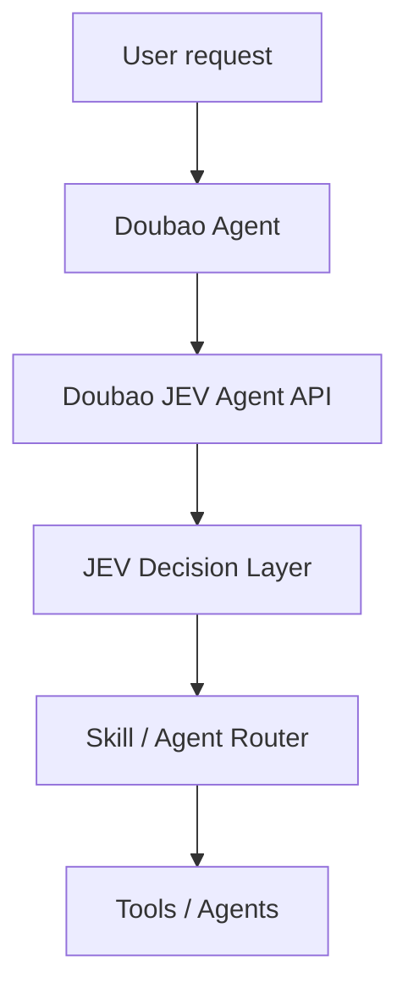
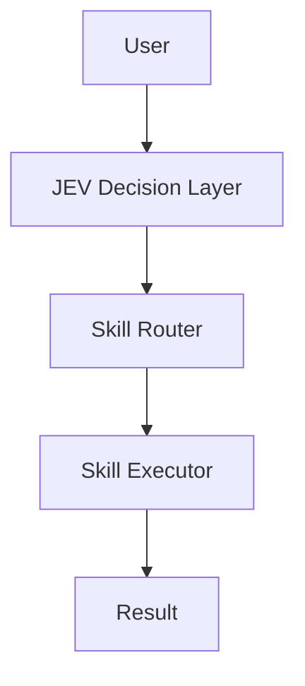

# Doubao JEV Agent

**A lightweight decision and action layer for Doubao Agent powered by JEV.**

> **LLM generates. JEV decides.**

Doubao JEV Agent is a small, extensible service that routes natural-language tasks to a Skill or Agent and can execute registered local Skills. It includes a deterministic mock JEV engine, a real TypeSafe JEV client, a provider-neutral Doubao adapter contract, and a FastAPI service. Skills currently demonstrate simulated local execution without external services.

## Why a decision layer?

An LLM can generate a response, but asking it to pick tools, skills, and agents anew on every turn can make orchestration hard to predict. This project puts routing behind a small decision interface: the caller supplies the task and allowed options, and the JEV client returns a constrained choice with confidence and a reason.

## Architecture



## Decision + Action Architecture



The `/api/v1/agent/run` endpoint sends the task to JEV with the registered skill names as allowed choices, then executes the selected skill locally and returns both the decision and execution result. The built-in career, paper, coding, and writing skills are simulation workflows and do not call external services.

Example request:

```bash
curl -X POST http://127.0.0.1:8000/api/v1/agent/run \
  -H 'Content-Type: application/json' \
  -d '{"task":"帮我分析这个招聘岗位"}'
```

Example response:

```json
{
  "decision": {"skill": "career_skill", "confidence": 0.95},
  "execution": {"status": "completed", "result": "Career analysis workflow executed"}
}
```

The JEV boundary is asynchronous and replaceable. Without `JEV_API_KEY`, the application uses its deterministic mock. When a key is present, it calls TypeSafe's hosted System One API and validates that the returned choice is among the requested options.

## Quick Start

Requires Python 3.11+.

```bash
python -m venv .venv
# Windows: .venv\Scripts\activate
source .venv/bin/activate
pip install -r requirements.txt
uvicorn src.main:app --reload
```

Open `http://127.0.0.1:8000/docs`. Try a route:

```bash
curl -X POST http://127.0.0.1:8000/route/skill \
  -H 'Content-Type: application/json' \
  -d '{"task":"帮我优化论文格式"}'
```

Response:

```json
{"skill":"paper_skill","confidence":0.94,"reason":"task requires paper or document formatting"}
```

## Demos

Run from the project root:

```bash
python -m examples.skill_router_demo
python -m examples.doubao_demo
python -m examples.agent_router_demo
python -m examples.agent_run_demo
```

The demos cover paper skill routing, career skill routing, GitHub issue to coding-agent routing, and the complete JEV decision-to-skill-execution flow.

## API

- `GET /health` — service health
- `POST /decide` — choose among caller-provided options (`task`, `options`)
- `POST /route/skill` — route a task to a built-in skill
- `POST /route/agent` — route a task to an agent
- `POST /api/v1/agent/run` — decide a skill and execute it

## MCP Integration

The [Model Context Protocol (MCP)](https://modelcontextprotocol.io/) is an open standard that lets AI applications connect to external tools through a consistent interface. Doubao JEV Agent exposes its decision engine and skill workflow as MCP tools, so compatible hosts such as Claude Desktop and Cursor can call them.


Install the project dependencies, then copy `mcp.json.example` into your MCP host configuration. Run the command from the repository root, or set the host configuration's working directory to the repository root so Python can import `src`.

```json
{
  "mcpServers": {
    "doubao-jev-agent": {
      "command": "python",
      "args": ["-m", "src.mcp.server"]
    }
  }
}
```

Start the server manually with `python -m src.mcp.server`. It uses stdio transport and selects the mock JEV client by default; set `JEV_API_KEY` to use the real TypeSafe JEV API.

| Tool | Description |
| --- | --- |
| `jev_decide` | Make a decision with JEV from a task and allowed options |
| `agent_run` | Decide a skill, execute it, and return the workflow result |
| `list_skills` | List available skills |

## Docker

```bash
docker compose up --build
```

The API is then available at `http://localhost:8000`. Mock mode is the default and requires no API key.

## Configure JEV API Key

To run the real JEV demo with TypeSafe:

1. In the project root, create a file named `.env` (or copy `.env.example` to `.env`).
2. Set `JEV_API_KEY` in `.env` to your real JEV API key:

   ```dotenv
   JEV_API_KEY=your_real_jev_api_key
   ```

3. Run the real demo from the project root:

   ```bash
   python -m examples.real_jev_demo
   ```

The demo uses the real TypeSafe JEV API when `JEV_API_KEY` is set. If it is empty or missing, the client uses the mock instead.

## Real JEV API Integration

Request a TypeSafe JEV API key through the [TypeSafe website](https://typesafe.ai/) and create a key in the console when your account has access. The client calls `POST https://api.typesafe.ai/v1/systemone` using Bearer authentication and a typed `choice` question. TypeSafe returns the choice, confidence, and probabilities; this project formats those fields into its `decision`, `confidence`, and `reason` result.

The key is loaded from `.env` by `JEVClient.from_env()` and is never stored in source. For a shell session, you can also export it directly:

```bash
# macOS / Linux
export JEV_API_KEY="your_key_here"

# PowerShell
$env:JEV_API_KEY = "your_key_here"
```

Run the demo from the repository root:

```bash
python -m examples.real_jev_demo
```

It sends `帮我分析这个招聘岗位` with `career_agent`, `coding_agent`, and `writing_agent` as allowed choices, then prints the structured decision, confidence, and reason. Without a key, it automatically runs in mock mode, so local development remains available.

API flow: the demo creates the shared `JEVClient` via `JEVClient.from_env()`, which selects TypeSafe when `JEV_API_KEY` is set or `MockJEVClient` otherwise. The TypeSafe client sends the task as `state`, asks one constrained choice question, validates the returned option, and adapts the typed answer to the existing `DecisionResult` model.

## Tests

```bash
pytest
```

## Roadmap

### v0.1

- Basic decision router
- Doubao skill routing
- Mock JEV engine
- FastAPI service and Docker packaging

### Future
- More Doubao Agent integrations
- Multi-agent workflows

## Scope

This is an early open-source MVP. It has no frontend, database, user system, SaaS layer, or real Doubao API binding. The adapter and JEV client interfaces are extension points, not claims of provider integration.

## License

MIT
