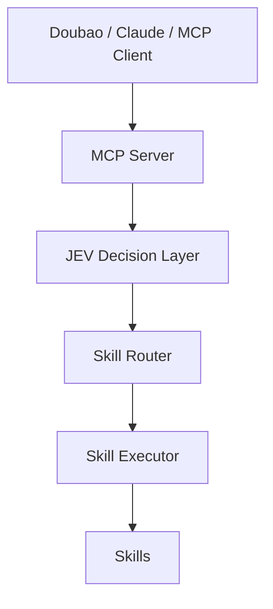

# Doubao-JEV-Agent

**A JEV-powered decision layer for MCP-compatible AI Agents.**

Let an AI Agent connect to the JEV Decision Engine through MCP to gain structured decisions, Skill Routing, and Agent Execution.

> **LLMs generate. JEV decides.**

Doubao-JEV-Agent is an open-source Python project that exposes JEV decisions and local skill workflows as MCP tools. An MCP-compatible host sends a task to the server; JEV selects from the allowed options; the Skill Executor runs the selected local skill and returns its result.

## Architecture



## What it does

- Exposes JEV decision-making, skill execution, and skill discovery as MCP tools.
- Uses the TypeSafe JEV API when `JEV_API_KEY` is configured, and validates that each returned choice is allowed.
- Falls back to a deterministic local mock when no key is configured, so the project can be tried without external credentials.
- Includes a FastAPI service, Docker packaging, and demo scripts alongside the MCP server.
- Provides an extensible skill registry and executor.

The included career, paper, coding, and writing skills are simulated workflows. They demonstrate routing and execution; they do not call external services or perform the described work themselves. The Doubao adapter is an extension contract, not a live Doubao API integration.

## Quick start

Requires Python 3.11 or later.

```bash
git clone https://github.com/qinpei-dev/Doubao-jev-agent.git
cd Doubao-jev-agent
python -m venv .venv
```

Activate the environment and install dependencies:

```bash
# macOS / Linux
source .venv/bin/activate

# Windows PowerShell
.venv\Scripts\Activate.ps1

pip install -r requirements.txt
```

### Run the HTTP API

```bash
uvicorn src.main:app --reload
```

Open [http://127.0.0.1:8000/docs](http://127.0.0.1:8000/docs) for interactive API documentation. The service starts in mock mode unless a JEV key is configured.

```bash
curl -X POST http://127.0.0.1:8000/api/v1/agent/run \
  -H 'Content-Type: application/json' \
  -d '{"task":"帮我分析这个招聘岗位"}'
```

Example response:

```json
{
  "decision": {"skill": "career_skill", "confidence": 0.95},
  "execution": {
    "status": "completed",
    "result": "Career analysis workflow executed"
  }
}
```

### Connect an MCP host

Install the dependencies, then add the following server entry to your MCP host configuration. Start the host with the repository root as its working directory so Python can import `src`.

```json
{
  "mcpServers": {
    "doubao-jev-agent": {
      "command": "python",
      "args": ["-m", "src.mcp.server"],
      "env": {}
    }
  }
}
```

You can also copy [`mcp.json.example`](mcp.json.example) as a starting point. The MCP server uses stdio transport and provides:

| Tool | Purpose |
| --- | --- |
| `jev_decide` | Choose from caller-provided options using JEV. |
| `agent_run` | Select a registered skill, execute it, and return the decision and result. |
| `list_skills` | List the skills registered on this server. |

Each user runs their own local MCP server. This project does not provide a shared remote MCP service or JEV quota.

### Use the real JEV API

Request your own JEV API key through [TypeSafe](https://typesafe.ai/). Set it in the server process environment or in a private, untracked `.env` file in the repository root:

```dotenv
JEV_API_KEY=your_own_key
```

Then run the MCP server as usual with `python -m src.mcp.server`, or run the real API demo:

```bash
python -m examples.real_jev_demo
```

Without a key, both use the local mock. With a key, requests go directly from your machine to TypeSafe over HTTPS using your account and quota. Never commit your `.env` file or put a key in an MCP configuration that you share.

## HTTP API

| Method | Path | Purpose |
| --- | --- | --- |
| `GET` | `/health` | Check service health. |
| `POST` | `/decide` | Choose from caller-provided options. |
| `POST` | `/route/skill` | Route a task to a built-in skill. |
| `POST` | `/route/agent` | Route a task to an agent. |
| `POST` | `/api/v1/agent/run` | Decide a skill and execute its workflow. |

## Demos

Run these commands from the repository root:

```bash
python -m examples.skill_router_demo
python -m examples.doubao_demo
python -m examples.agent_router_demo
python -m examples.agent_run_demo
python -m examples.real_jev_demo
```

The demos use the local mock by default. `agent_run_demo` and `real_jev_demo` use TypeSafe JEV when `JEV_API_KEY` is set. No demo includes a bundled API key or project-provided quota.

## Docker

```bash
docker compose up --build
```

The API is available at `http://localhost:8000`. Docker Compose binds the host port to `127.0.0.1`; mock mode is the default.

## Security and deployment

- Use your own JEV API key. The project has no shared credentials or quota.
- Keep `.env` and any MCP host configuration containing a key private.
- The HTTP API has no authentication. Keep it on a trusted local interface when using a real key; the included Compose configuration binds it to localhost.
- Real JEV requests go directly from your server to `https://api.typesafe.ai/v1/systemone` over HTTPS.

## Development

```bash
python -m pytest
```

To add a skill, implement the skill interface in `src/skills/base.py` and register an instance in `src/skills/registry.py`. The router offers registered skill names as the allowed decisions, and the executor dispatches the selected skill.

## Project status

This is an early open-source MVP prepared for the **v0.1.0** release. It includes the decision and MCP integration layer, local demo workflows, and an HTTP API. It does not include a frontend, database, user system, hosted SaaS, or a live Doubao API binding.

## License

Distributed under the [MIT License](LICENSE).
