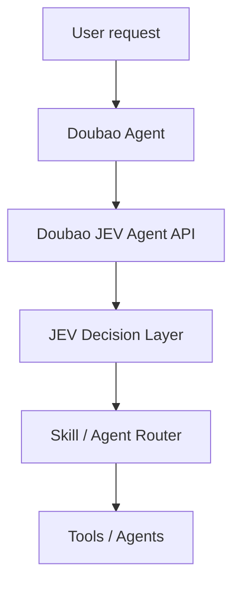
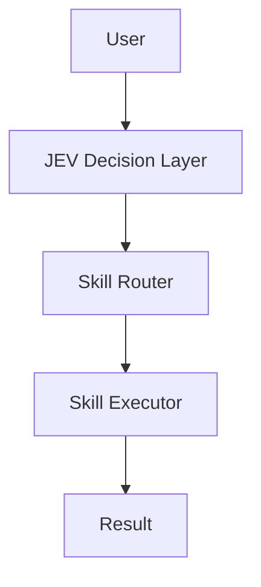

# Doubao JEV Agent

**A lightweight decision and action layer for Doubao Agent powered by JEV.**

> **LLM generates. JEV decides.**

Doubao JEV Agent is a small, extensible service that routes natural-language tasks to a Skill or Agent and can execute registered local Skills. It includes a deterministic mock JEV engine, a real TypeSafe JEV client, a provider-neutral Doubao adapter contract, and a FastAPI service. Skills currently demonstrate simulated local execution without external services.

## Why a decision layer?

An LLM can generate a response, but asking it to pick tools, skills, and agents anew on every turn can make orchestration hard to predict. This project puts routing behind a small decision interface: the caller supplies the task and allowed options, and the JEV client returns a constrained choice with confidence and a reason.

## Architecture



## Decision + Action Architecture



The `/api/v1/agent/run` endpoint sends the task to JEV with the registered skill names as allowed choices, then executes the selected skill locally and returns both the decision and execution result. The built-in career, paper, coding, and writing skills are simulation workflows and do not call external services.

Example request:

```bash
curl -X POST http://127.0.0.1:8000/api/v1/agent/run \
  -H 'Content-Type: application/json' \
  -d '{"task":"帮我分析这个招聘岗位"}'
```

Example response:

```json
{
  "decision": {"skill": "career_skill", "confidence": 0.95},
  "execution": {"status": "completed", "result": "Career analysis workflow executed"}
}
```

The JEV boundary is asynchronous and replaceable. Without `JEV_API_KEY`, the application uses its deterministic mock. When a key is present, it calls TypeSafe's hosted System One API and validates that the returned choice is among the requested options.

## Quick Start

Requires Python 3.11+.

```bash
python -m venv .venv
# Windows: .venv\Scripts\activate
source .venv/bin/activate
pip install -r requirements.txt
uvicorn src.main:app --reload
```

Open `http://127.0.0.1:8000/docs`. Try a route:

```bash
curl -X POST http://127.0.0.1:8000/route/skill \
  -H 'Content-Type: application/json' \
  -d '{"task":"帮我优化论文格式"}'
```

Response:

```json
{"skill":"paper_skill","confidence":0.94,"reason":"task requires paper or document formatting"}
```

## Demos

Run from the project root:

```bash
python -m examples.skill_router_demo
python -m examples.doubao_demo
python -m examples.agent_router_demo
python -m examples.agent_run_demo
```

**Mock mode (no API key):** `skill_router_demo`, `doubao_demo`, and `agent_router_demo` always use the local mock. `agent_run_demo` also uses the mock when `JEV_API_KEY` is unset.

**Real mode (your own API key required):** `agent_run_demo` and `real_jev_demo` call TypeSafe JEV when your local `JEV_API_KEY` is set. `real_jev_demo` falls back to the mock when the key is unset. No demo uses a bundled key or project-provided JEV quota.

## API

- `GET /health` — service health
- `POST /decide` — choose among caller-provided options (`task`, `options`)
- `POST /route/skill` — route a task to a built-in skill
- `POST /route/agent` — route a task to an agent
- `POST /api/v1/agent/run` — decide a skill and execute it

## MCP Integration

The [Model Context Protocol (MCP)](https://modelcontextprotocol.io/) is an open standard that lets AI applications connect to external tools through a consistent interface. Doubao JEV Agent exposes its decision engine and skill workflow as MCP tools, so compatible hosts such as Claude Desktop and Cursor can call them. Each user runs this MCP server locally; this project does not provide a shared remote MCP service.


Install the project dependencies, then copy `mcp.json.example` into your local MCP host configuration. Run the command from the repository root, or set the host configuration's working directory to the repository root so Python can import `src`. The example's empty `env` map contains no credentials; the server reads `JEV_API_KEY` from its local process environment or local `.env` file.

```json
{
  "mcpServers": {
    "doubao-jev-agent": {
      "command": "python",
      "args": ["-m", "src.mcp.server"],
      "env": {}
    }
  }
}
```

Start the server manually with `python -m src.mcp.server`. It uses stdio transport and selects the mock JEV client when no key is configured. For real decisions, set your own `JEV_API_KEY` in the local server process environment. If your MCP host does not pass shell environment variables to child processes, configure the key through that host's local per-server environment settings and keep the configuration private.

| Tool | Description |
| --- | --- |
| `jev_decide` | Make a decision with JEV from a task and allowed options |
| `agent_run` | Decide a skill, execute it, and return the workflow result |
| `list_skills` | List available skills |

## Docker

```bash
docker compose up --build
```

The API is then available at `http://localhost:8000`. Docker Compose binds the port to `127.0.0.1` on the host. Mock mode is the default and requires no API key.

## API Key and Usage Model

This open-source project provides no JEV API quota or shared author account. To call the real JEV API, each user needs their **own** TypeSafe JEV API key and runs their **own local** MCP server. Calls made with that key use the user's JEV account and quota.

Set the key in the local server process environment or in a private, untracked `.env` file:

```dotenv
JEV_API_KEY=your_own_key
```

Without a key, the server uses the deterministic mock and makes no JEV API request. With a key, the client sends requests directly to `https://api.typesafe.ai/v1/systemone` over HTTPS using that key. The author does not operate an intermediate service for these calls.

## Configure JEV API Key

To run the real JEV demo with TypeSafe:

1. In the project root, create a file named `.env` (or copy `.env.example` to `.env`).
2. Set `JEV_API_KEY` in `.env` to your real JEV API key:

   ```dotenv
   JEV_API_KEY=your_own_key
   ```

3. Run the real demo from the project root:

   ```bash
   python -m examples.real_jev_demo
   ```

The demo uses the real TypeSafe JEV API when `JEV_API_KEY` is set. If it is empty or missing, the client uses the mock instead.

## Real JEV API Integration

Request a TypeSafe JEV API key through the [TypeSafe website](https://typesafe.ai/) and create a key in the console when your account has access. The client calls `POST https://api.typesafe.ai/v1/systemone` using Bearer authentication and a typed `choice` question. TypeSafe returns the choice, confidence, and probabilities; this project formats those fields into its `decision`, `confidence`, and `reason` result.

The key is loaded from the local process environment or `.env` by `JEVClient.from_env()` and is never stored in source. For a shell session, you can also export your own key directly:

```bash
# macOS / Linux
export JEV_API_KEY="your_own_key"

# PowerShell
$env:JEV_API_KEY = "your_own_key"
```

Run the demo from the repository root:

```bash
python -m examples.real_jev_demo
```

It sends `帮我分析这个招聘岗位` with `career_agent`, `coding_agent`, and `writing_agent` as allowed choices, then prints the structured decision, confidence, and reason. Without a key, it automatically runs in mock mode, so local development remains available.

API flow: the demo creates the shared `JEVClient` via `JEVClient.from_env()`, which selects TypeSafe when `JEV_API_KEY` is set or `MockJEVClient` otherwise. The TypeSafe client sends the task as `state`, asks one constrained choice question, validates the returned option, and adapts the typed answer to the existing `DecisionResult` model.

## Security

- Do not commit `.env` or put a real key in `mcp.json.example`, source code, or documentation. `.env` is ignored by Git.
- Use your own JEV API key. The project has no shared quota or author-provided credentials.
- The key is stored locally and sent only from your server directly to TypeSafe JEV over HTTPS for real requests. Keep any MCP host configuration containing a key private.
- The HTTP API has no authentication. Keep it bound to localhost when using a real key; the included Docker Compose configuration does this by default.

## Tests

```bash
python -m pytest
```

## Roadmap

### v0.1

- Basic decision router
- Doubao skill routing
- Mock JEV engine
- FastAPI service and Docker packaging

### Future
- More Doubao Agent integrations
- Multi-agent workflows

## Scope

This is an early open-source MVP. It has no frontend, database, user system, SaaS layer, or real Doubao API binding. The adapter and JEV client interfaces are extension points, not claims of provider integration.

## License

MIT
