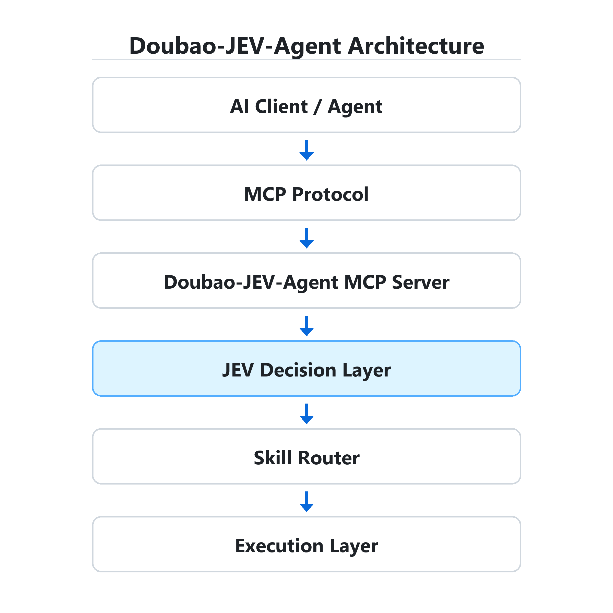

# Doubao-JEV-Agent

[English](README.md) | [中文](README_CN.md)

**一个通过 MCP 暴露的 JEV 决策层，为 MCP-compatible AI Agents 提供结构化决策和技能路由能力。**

本项目在 AI 客户端与执行流程之间提供轻量的 Decision Layer。项目最初面向豆包 MCP 集成开发，目前支持 MCP-compatible 客户端。

Doubao-JEV-Agent 以 MCP Server 的形式服务于 Agent 客户端及其工作流。MCP-compatible AI Agent 提交任务和允许选择的选项，JEV 从中作出选择，再由本地 Skill Executor 执行选中的技能。完整的 Agent 工作流仍由客户端负责。本项目不是 AI Agent Framework。

## 演示


已测试的 MCP 客户端：

- Doubao Desktop MCP Connector
- Antigravity MCP Client

真实 MCP 调用 → 真实 TypeSafe JEV API → 决策结果。

在仓库根目录运行决策与本地技能执行演示：

```bash
python -m examples.agent_run_demo
```

在 mock 模式下，示例会选择 `career_skill`，并显示执行结果：

```text
JEV: career_skill (91.00%)
Executor: career_skill.execute()
结果: Career analysis workflow executed
```

运行此演示无需 API key。设置 `JEV_API_KEY` 后，演示会调用真实的 TypeSafe JEV API，决策结果可能不同。

## Features

- 通过 MCP 工具提供 JEV 决策、技能执行和技能发现。
- 配置 `JEV_API_KEY` 后调用 TypeSafe JEV API，并校验返回的选项是否在调用方允许的范围内。
- 未配置 key 时使用确定性的本地 mock，方便在没有外部凭据的情况下体验项目。
- 除 MCP Server 外，还提供 FastAPI 服务、Docker 打包配置和演示脚本。
- 提供可扩展的技能注册表和 Skill Executor。

内置的职业、论文、编程、研究和写作技能均为模拟工作流，用于展示路由与执行流程；它们不会调用外部服务，也不会真正完成所描述的任务。豆包适配器定义的是扩展接口，并非可用的豆包 API 集成。

## Why Decision Layer?

现代 AI Agents 常让 LLM 同时负责内容生成和决策。本项目把结构化决策与可预测的路由交给独立、轻量的 Decision Layer。

没有 Decision Layer 时：

```text
任务
  ↓
LLM 决策
  ↓
执行
```

使用 JEV 时：

```text
任务
  ↓
JEV Decision Layer
  ↓
技能路由
  ↓
执行
```

MCP 客户端提供任务和允许的选项。JEV 返回选择，系统在路由前检查该选择是否属于允许范围。LLM 仍可生成内容并管理完整的 Agent 工作流。具体示例和限制见[决策路由用例](docs/use-cases.md)。

## 架构



MCP 负责通信；JEV 根据客户端允许的选项作出结构化决策；Skill Router 找到已注册的技能；Skill Executor 运行相应的本地工作流。

## Quick Start

需要 Python 3.11 或更新版本。

```bash
git clone https://github.com/qinpei-dev/Doubao-jev-agent.git
cd Doubao-jev-agent
python -m venv .venv
```

激活虚拟环境并安装依赖：

```bash
# macOS / Linux
source .venv/bin/activate

# Windows PowerShell
.venv\Scripts\Activate.ps1

pip install -r requirements.txt
```

运行 `python -m examples.agent_run_demo` 体验 mock 工作流，或启动 HTTP API：

```bash
uvicorn src.main:app --reload
```

打开 [http://127.0.0.1:8000/docs](http://127.0.0.1:8000/docs) 查看交互式 API 文档。未配置 JEV key 时，服务默认使用 mock 模式。

## MCP

MCP（Model Context Protocol）为 AI 客户端连接外部工具与服务提供标准方式。本 MCP Server 暴露 `jev_decide`、`agent_run` 和 `list_skills`。

安装依赖后，将以下配置加入 MCP host。启动 host 时，以仓库根目录为工作目录，使 Python 能导入 `src`。

```json
{
  "mcpServers": {
    "doubao-jev-agent": {
      "command": "python",
      "args": ["-m", "src.mcp.server"],
      "env": {}
    }
  }
}
```

也可以从 [`mcp.json.example`](mcp.json.example) 开始配置。桌面端安装步骤见[豆包 MCP 配置](docs/doubao-mcp.md)。MCP Server 使用 stdio 传输，提供以下工具：

| 工具 | 用途 |
| --- | --- |
| `jev_decide` | 使用 JEV 从调用方给定的选项中作出选择。 |
| `agent_run` | 选择并执行已注册的技能，返回决策和执行结果。 |
| `list_skills` | 列出此服务器已注册的技能。 |

### MCP Client Compatibility

MCP 连接已在 Doubao Desktop 和 Antigravity 上测试。具体交互见 [MCP 客户端兼容性说明](docs/mcp-clients.md)。每位用户都需要运行自己的本地 MCP Server；本项目不提供共享的远程 MCP 服务或 JEV 额度。

### 使用真实 JEV API

通过 [TypeSafe](https://typesafe.ai/) 申请自己的 JEV API key。将其设为服务器进程的环境变量，或写入仓库根目录中私有且不受版本控制的 `.env` 文件：

```dotenv
JEV_API_KEY=your_own_key
```

之后运行 `python -m src.mcp.server` 启动 MCP Server，或运行真实 API 演示：

```bash
python -m examples.real_jev_demo
```

未配置 key 时，两者都使用本地 mock。配置 key 后，请求会从你的设备通过 HTTPS 直接发送至 TypeSafe，并使用你自己的账号和额度。不要提交 `.env` 文件，也不要在共享的 MCP 配置中放入 key。

## 示例

在仓库根目录运行以下命令：

```bash
python -m examples.skill_router_demo
python -m examples.doubao_demo
python -m examples.agent_router_demo
python -m examples.agent_run_demo
python -m examples.real_jev_demo
```

演示默认使用本地 mock。设置 `JEV_API_KEY` 后，`agent_run_demo` 和 `real_jev_demo` 会使用 TypeSafe JEV。演示不附带 API key，也不提供项目共享额度。

## 决策路由示例

路由流程为 **任务 → JEV 决策 → 选中技能 → 执行路径**。以下示例通过当前环境选定的 JEV 客户端展示决策环节，只返回选择，不执行技能。未配置 `JEV_API_KEY` 时，本地 mock 给出确定性的演示结果；配置 key 后，选择来自真实的 TypeSafe JEV API，结果可能不同。请在仓库根目录运行：

### Use Cases

- [Agent Routing](examples/use_cases/career_decision.py)：`python -m examples.use_cases.career_decision`
- [Coding Decision](examples/use_cases/coding_decision.py)：`python -m examples.use_cases.coding_decision`
- [Research Decision](examples/use_cases/tool_selection.py)：`python -m examples.use_cases.tool_selection`

各用例的设计思路见[决策路由用例](docs/use-cases.md)。

### HTTP API 示例

本地 API 启动后，可以发送任务：

```bash
curl -X POST http://127.0.0.1:8000/api/v1/agent/run \
  -H 'Content-Type: application/json' \
  -d '{"task":"帮我分析这个招聘岗位"}'
```

在 mock 模式下，响应包含选中的技能和执行结果。服务还提供：

| 方法 | 路径 | 用途 |
| --- | --- | --- |
| `GET` | `/health` | 检查服务健康状态。 |
| `POST` | `/decide` | 从调用方提供的选项中选择。 |
| `POST` | `/route/skill` | 将任务路由至内置技能。 |
| `POST` | `/route/agent` | 将任务路由至 Agent。 |
| `POST` | `/api/v1/agent/run` | 决定使用哪项技能，并执行其工作流。 |

## Decision Routing Evaluation

评估结果见 [Decision Routing Evaluation](benchmark/results.md)。运行 `python benchmark/run_benchmark.py` 可在本地重新生成。10 个示例任务覆盖职业、编程、研究和写作技能的决策路由流程、示例任务匹配、置信度及本地演示执行。决策后端是确定性的本地 mock；其延迟不能代表真实 API 的延迟或 LLM 生成速度。这项评估不对性能或成本作出结论，也不会调用付费模型或外部研究服务。

## 路线图

最新发布版本为 [v0.2.1](https://github.com/qinpei-dev/Doubao-jev-agent/releases/tag/v0.2.1)，包括 MCP 决策层、本地模拟工作流、HTTP API 和离线决策路由评估。未来可能增加更多 MCP host 配置示例，但尚未承诺交付日期。

## Docker

```bash
docker compose up --build
```

API 位于 `http://localhost:8000`。Docker Compose 将主机端口绑定到 `127.0.0.1`，默认使用 mock 模式。

## 安全与部署

- 使用你自己的 JEV API key；项目没有共享凭据或额度。
- 对 `.env` 及含有 key 的 MCP host 配置保密。
- HTTP API 没有身份验证。使用真实 key 时，应将其限制在可信的本地接口；项目自带的 Compose 配置将其绑定到 localhost。
- 真实 JEV 请求会从你的服务器通过 HTTPS 直接发送至 `https://api.typesafe.ai/v1/systemone`。

## Contributing

提交更改前运行 `python -m pytest`。技能扩展步骤和贡献建议见 [CONTRIBUTING.md](CONTRIBUTING.md)。

## 扩展技能

开发者可以添加 `BaseSkill` 子类来扩展本地技能注册表。子类需提供 `name`、`description` 和 `execute(input)`，并将实例注册到 `SkillRegistry`。可运行的示例见[自定义技能示例](examples/custom_skill.py)。若要让默认 MCP Server 提供新技能，还需按 [CONTRIBUTING.md](CONTRIBUTING.md) 的说明将其加入 `create_default_registry()`。

漏洞报告和凭据使用建议见[安全政策](SECURITY.md)。

## 许可证

本项目采用 [MIT License](LICENSE)。
